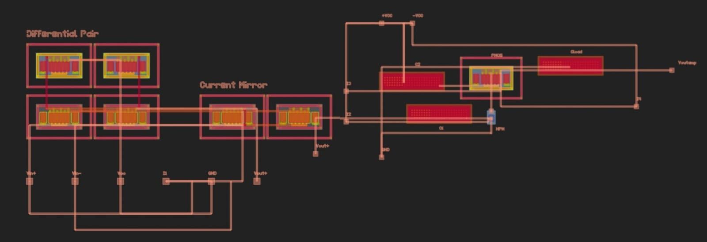
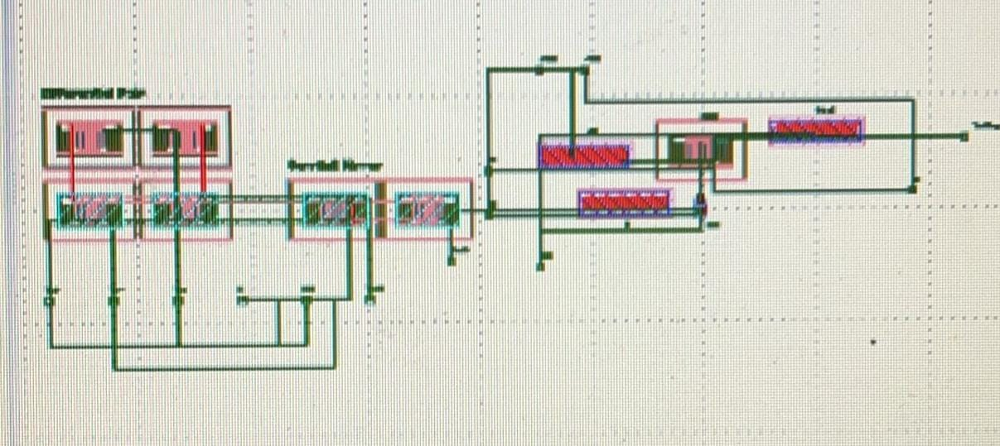

# Op-Amp Design Challenge by GenYZ
### *Track: Analog Automation AI/LLM using Glayout*
----
## Op Amp Design Using LTSpice
MODELS OR COMPONENTS USED
- NPN: DI_MMBT3904
- NMOS: CMOSN technology: 180nm
- PMOS: CMOSP technology: 180nm
- Capacitor 5pF for Load, Capacitor 10uF for Coupling

Objective:
Build an OpAmp using any suitable architecture with the GF180 PDK with the following baseline specifications at a 5pF Capacitive Load:
- Supply Voltage: 1.8V
- DC Gain: >70 dB
- CMRR: >85 dB
- Phase Margin: >45 degrees
- Power Dissipation: <500 µW
- Unity Gain Bandwidth: >10 MHz
- Output Swing: >1.0 Vpp

Our design have the design of 2 STAGE AMPLIFIER :
<p align="center">
  
</p>
<h4 align="center" style="font-size:16px;">Figure 1. Operational Amplifier Design Using LTSpice</h4>


<p align="center">
  
  
</p>
<p align="center" style="font-size:16px;">
  <b>Figure 2.</b> Bode Plot for AC Simulatiom &nbsp;&nbsp;&nbsp;&nbsp;
  <b>Figure 3.</b> V<sub>out</sub> in Transient Mode for Output Swing
</p>

<p align="center">
  
  
</p>
<p align="center" style="font-size:16px;">
  <b>Figure 4.</b> DC Operating Point (1) &nbsp;&nbsp;&nbsp;&nbsp;
  <b>Figure 5.</b> V<sub>out</sub> DC Operating Point (2)
</p>


---
## Layout Design Using Jupyter Notebook

- Gitclone this repo
  ```bash
  git clone https://github.com/aurxdeqo/gLayout-genyz-team.git'
- Go to the folder
  ```bash
  cd gLayout-genyz-team/JupyterNotebook
- Start and run Jupyter notebook
  ```bash
  jupyter notebook
- search for [Layout](JupyterNotebook/opamp_challenge_final.ipynb) on jupyter notebook file, and run the file
  
- When u run the .ipynb file, you should see the display as below.
  <p align="center">
  
</p>
<h4 align="center" style="font-size:16px;">Figure 6. Display on Jupyter Notebook</h4>

- When you open the generated .gds file after running the .ipynb file, you should see the display as below.
  <p align="center">
  
</p>
<h4 align="center" style="font-size:16px;">Figure 7. Display on K-Layout </h4>

---
## Testbench Using NGSpice
- Gitclone this repo
  ```bash
  git clone https://github.com/aurxdeqo/gLayout-genyz-team.git'
  
- Go to the folder
  ```bash
  cd gLayout-genyz-team/NGSpice
  
- Download and run [testbench](NGSpice/testbench.cir) on ngspice
  ```bash
  # on ngspice terminal
  ngspice opampchallange.cir

** Note about the Specification Checking
[ Ngspice simulation still fulfill the below specification, but different from our original design in LTSPICE. It might be caused by the difference of MOSFET type/model. We showed you expected result from LTSPICE above already. You can see Ngspice simulation by the step above. ]

- After running the .cir file, you should see some plots, showing you the parameter given for the specs. You can see Gain DC, Phase Margin (Phase at 0dB Gain + 180deg), Unity Gain Bandwith/Frequency from Bodeplot Magnitude and Phase. You can also see the Output swing from the plot .tran simulation.
  
- CMRR can be observed as follow (manually)
  Update input sources for differential mode and common mode in LT SPICE
  (1) Open opamp_design.asc file for LTSPICE in the NgSPICE folder
  (2) Make sure you have the library TSMC 180 for 180nm Technology
  Download the following files (*Credits from Sanjay Vihdyadharan on Youtube)
  https://sanjayvidhyadharan.in/Downloads
  (a) tsmc018.lib
  (b) cmosn.asy
  (c) cmosp.asy
  export it in your LTSPICE to use the component models.
- For Differential Input, we used it as a testbench here (VIN AC +1 and -1). Adiff +/- 93.88dB
  <p align="center">
  
</p>
<h4 align="center" style="font-size:16px;">Figure 8. CMRR Simulation (1) </h4>
- For Common mode, use the same AC 1 0 (same amplitude and same phase for VIN AC). You will get Acommon-mode is +/- 10dB
- As result you can count that CMRR = 20*log(Adiff/Acomm) = Adiff(dB) - Acomm(dB) = +/- 84/85 dB

- Power consumption
  Since the I and VDD is constant, the power consumption (I1+I2+I3+I4)*VDD = 451.8 uW (under 500uW). You can see from the circuit.
  
