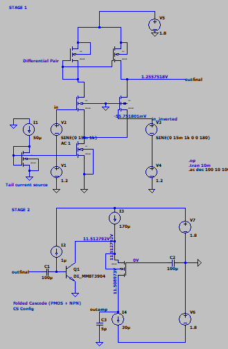
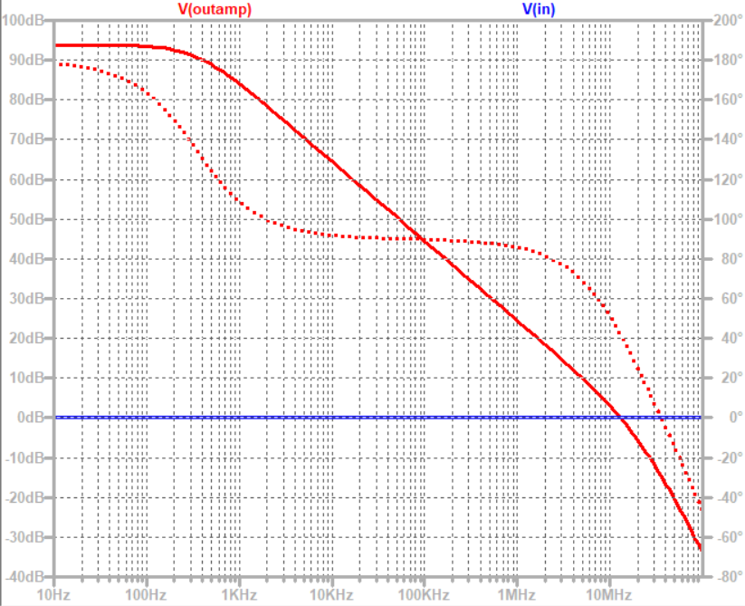

# Op-Amp Challange by GenYZ
### *Track: Analog Automation AI/LLM using Glayout*
----
## Op Amp Design Using LTSpice
model used
- NPN: DI_MMBT3904
- NMOS: CMOSN
- PMOS: CMOSP
- technology: 180nm

<p align="center">
  
</p>
<h4 align="center" style="font-size:16px;">Figure 1. Operational Amplifier Design Using LTSpice</h4>

<p align="center">
  
</p>
<h4 align="center" style="font-size:16px;">Figure 2. Operational Amplifier Gain</h4>

<p align="center">
  
</p>
<h4 align="center" style="font-size:16px;">Figure 3. Vout in Transient Mode for Output Swing</h4>

<p align="center">
  
</p>
<h4 align="center" style="font-size:16px;">Figure 4. DC Operating Point (1)</h4>

<p align="center">
  
</p>
<h4 align="center" style="font-size:16px;">Figure 5. DC Operating Point (2)</h4>

---
## Layout Design Using Jupyter Notebook

- Gitclone this repo
  ```bash
  git clone https://github.com/aurxdeqo/gLayout-genyz-team.git'
- Go to the folder
  ```bash
  cd gLayout-genyz-team/JupyterNotebook
- Start and run Jupyter notebook
  ```bash
  jupyter notebook
- search for [Layout](JupyterNotebook/Layout.ipynb) on jupyter notebook file, and run the file

---
## Testbench Using NGSpice
- Gitclone this repo
  ```bash
  git clone https://github.com/aurxdeqo/gLayout-genyz-team.git'
  
- Go to the folder
  ```bash
  cd gLayout-genyz-team/NGSpice
  
- Download [requirement](NGSpice/requirement.txt) for models
  ```bash
  #  on linux terminal
  pip install -r requirements.txt
  
- Download and run [testbench](NGSpice/testbench.cir) on ngspice
  ```bash
  # on ngspice terminal
  ngspice opampchallange.cir

- CMRR can be observed as follow
  Update input sources for differential mode


- Power consumption
  Since the I and VDD is constant, the power consumption (I1+I2+I3+I4)*VDD = 451.8 uW (under 500uW)
  
