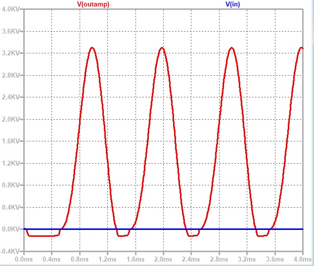

# Op-Amp Design Challenge by GenYZ
### *Track: Analog Automation AI/LLM using Glayout*
----
## Op Amp Design Using LTSpice
MODELS OR COMPONENTS USED
- NPN: DI_MMBT3904
- NMOS: CMOSN technology: 180nm
- PMOS: CMOSP technology: 180nm
- Capacitor 5pF for Load, Capacitor 10uF for Coupling

Objective:
Build an OpAmp using any suitable architecture with the GF180 PDK with the following baseline specifications at a 5pF Capacitive Load:
- Supply Voltage: 1.8V
- DC Gain: >70 dB
- CMRR: >85 dB
- Phase Margin: >45 degrees
- Power Dissipation: <500 µW
- Unity Gain Bandwidth: >10 MHz
- Output Swing: >1.0 Vpp

Our design have the design of 2 STAGE AMPLIFIER :
<p align="center">
  
</p>
<h4 align="center" style="font-size:16px;">Figure 1. Operational Amplifier Design Using LTSpice</h4>


<p align="center">
  
  
</p>
<p align="center" style="font-size:16px;">
  <b>Figure 2.</b> Bode Plot for AC Simulatiom &nbsp;&nbsp;&nbsp;&nbsp;
  <b>Figure 3.</b> V<sub>out</sub> in Transient Mode for Output Swing
</p>

<p align="center">
  
  
</p>
<p align="center" style="font-size:16px;">
  <b>Figure 4.</b> DC Operating Point (1) &nbsp;&nbsp;&nbsp;&nbsp;
  <b>Figure 5.</b> V<sub>out</sub> DC Operating Point (2)
</p>


---
## Layout Design Using Jupyter Notebook

- Gitclone this repo
  ```bash
  git clone https://github.com/aurxdeqo/gLayout-genyz-team.git'
- Go to the folder
  ```bash
  cd gLayout-genyz-team/JupyterNotebook
- Start and run Jupyter notebook
  ```bash
  jupyter notebook
- search for [Layout](JupyterNotebook/Layout.ipynb) on jupyter notebook file, and run the file

---
## Testbench Using NGSpice
- Gitclone this repo
  ```bash
  git clone https://github.com/aurxdeqo/gLayout-genyz-team.git'
  
- Go to the folder
  ```bash
  cd gLayout-genyz-team/NGSpice
  
- Download [requirement](NGSpice/requirement.txt) for models
  ```bash
  #  on linux terminal
  pip install -r requirements.txt
  
- Download and run [testbench](NGSpice/testbench.cir) on ngspice
  ```bash
  # on ngspice terminal
  ngspice opampchallange.cir

- CMRR can be observed as follow
  Update input sources for differential mode


- Power consumption
  Since the I and VDD is constant, the power consumption (I1+I2+I3+I4)*VDD = 451.8 uW (under 500uW)
  
